# README

# SQL :- Data-Analytics-Project

A comprehensive collection of SQL scripts created for data exploration, analysis, and reporting. The repository covers a wide range of analytical tasks, including database exploration, key measures and metrics, time-based analysis, cumulative calculations, customer segmentation, and more. These SQL queries are designed to help data analysts and BI professionals efficiently explore, understand, segment, and analyze data stored in relational databases. Each script focuses on a specific analytical concept and demonstrates practical SQL techniques and best practices for effective data analysis.

---

## Table of contents

- [Dimensions vs Measures](#dimensions-vs-measures)
- [Data Analytics](#data-analytics)
- [Exploratory Data Analysis (EDA)](#exploratory-data-analysis-eda)
- [Advanced Analytics](#advanced-analytics)
- [Key SQL Learnings](#key-sql-learnings)
- [License](#license)


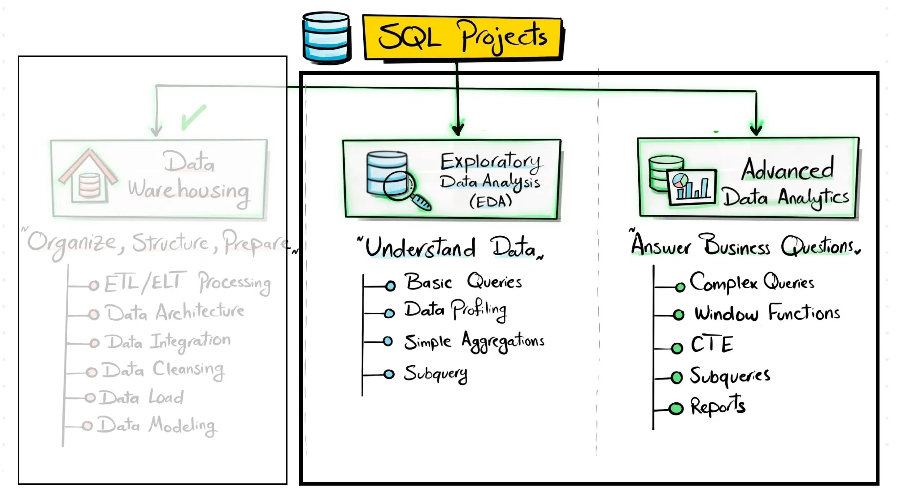
**Description of Project Steps: Exploratory Data Analysis (EDA) & Project: Advanced Data Analytic**


## Dimensions vs Measures

### 1. Dimension — Definition

A **Dimension** is a descriptive attribute used to **categorize, group, filter, or analyze data**. Dimensions usually answer questions like:

- **What?, Who?, Where?, When?, Which category?**

Examples: Category, Product, Birthdate, Customer ID, Country, Region, Gender

A dimension does **not normally make sense to aggregate**.

#### Examples

| Dimension | Why? |
| --- | --- |
| Category | Used to group products |
| Product | Identifies a product |
| Birthdate | Describes when a person was born |
| Customer ID | Identifies a customer |
| Country | Groups customers/sales by country |

Even if a dimension contains numbers, it can still be a dimension.

**Example:**

`Customer ID = 101, 102, 103`

Although Customer ID is numeric, it does **not** make sense to calculate:

> SUM(Customer ID)
> 

The numbers are identifiers, not quantities.

So:

**Numeric ≠ automatically Measure**

### 2. Measure — Definition

A **Measure** is a numeric value that represents something that can be **meaningfully calculated or aggregated**.

Measures usually answer questions like:

- **How much?, How many?, How old?, How much revenue?, How many products?**

Examples:

- Sales, Quantity, Age, Profit, Cost, Revenue, Discount

Common aggregations include:

- `SUM`
- `AVG`
- `MIN`
- `MAX`
- `COUNT`

### Examples

| Measure | Possible Aggregation |
| --- | --- |
| Sales | SUM(Sales) |
| Quantity | SUM(Quantity) |
| Age | AVG(Age) |
| Profit | SUM(Profit) |
| Cost | AVG(Cost) |

```
                Dataset
                   │
                   ▼
          Is it Numeric?
                   │
          ┌────────┴────────┐
          │                 │
         NO                YES
          │                 │
          ▼                 ▼
      Dimension      Does it make sense
                     to Aggregate?
                          │
                   ┌──────┴──────┐
                   │             │
                  NO            YES
                   │             │
                   ▼             ▼
               Dimension       Measure
```

---

## **Data Analytics**

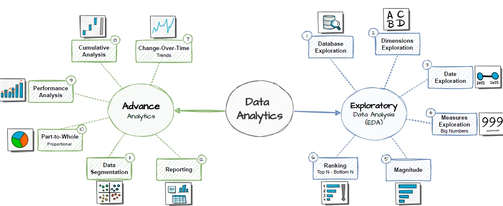

**Data Analytics Steps**

### Exploratory Data Analysis (EDA)

1. **Database Exploration**
2. **Dimensions Exploration**
3. **Date Exploration**
4. **Measures Exploration**
5. **Magnitude**
6. **Ranking** — Top N / Bottom N

### Advanced Analytics

1. **Change-Over-Time Trends**
2. **Cumulative Analysis**
3. **Performance Analysis**
4. **Part-to-Whole** ( **Proportional )** 
5. **Data Segmentation**
6. **Reporting**

## Explanation of each step

### Exploratory Data Analysis (EDA)

#### 1. Database Exploration

Understand the overall structure of the database, including tables, columns, relationships, data types, and the available data.


#### 2. Dimensions Exploration

Identify the unique values or categories within each dimension. Helps understand how the data can be grouped, filtered, or segmented for further analysis.

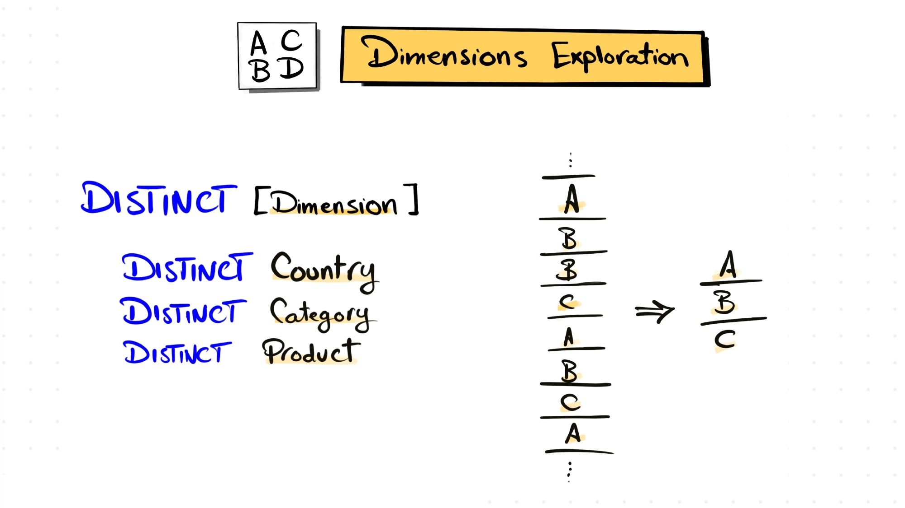

#### 3. Date Exploration

Identify the earliest and latest dates in the data. Helps understand the **time range, data coverage, and available historical period**.

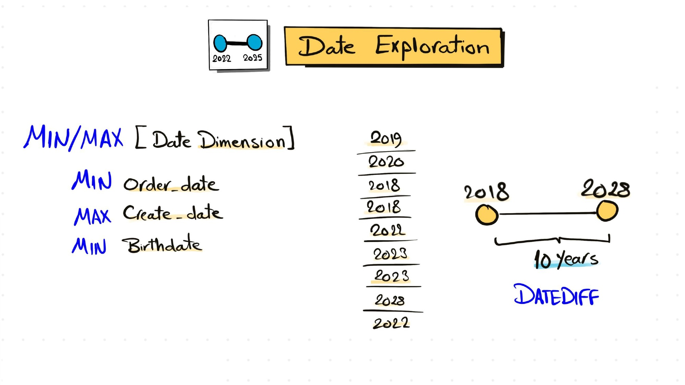

#### 4. Measures Exploration

Calculate and examine the key business metrics or **Big Numbers** at the highest level of aggregation. Helps provide an overall understanding of business performance before drilling into details.

> **Highest Level of Aggregation → Lowest Level of Detail**
> 

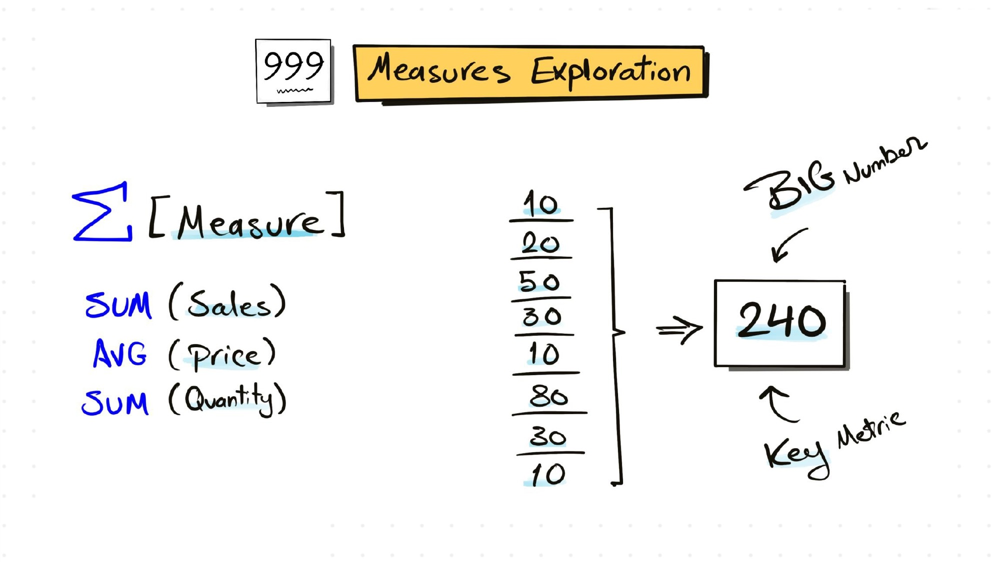

#### 5. Magnitude

Compare measure values across different categories. Helps understand the **relative importance and magnitude** of each category.

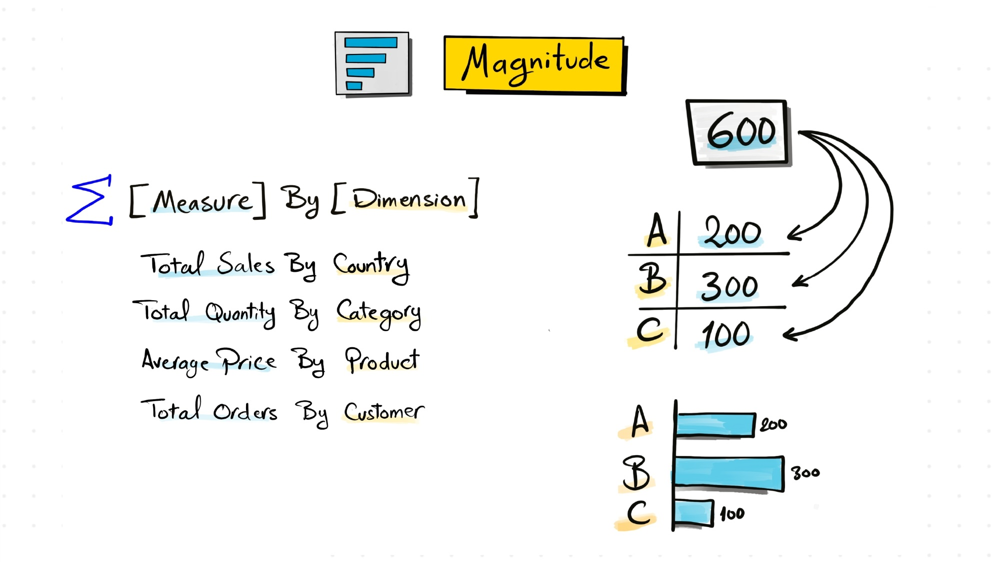

#### 6. Ranking — Top N / Bottom N

Order dimensions or categories based on a measure. Helps identify the **Top N and Bottom N performers**.

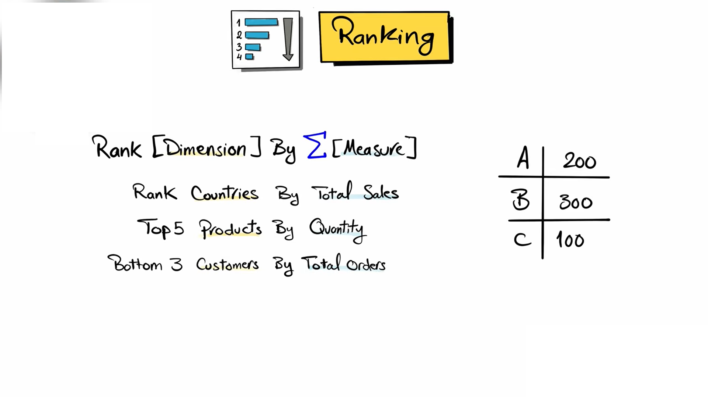

---

### Advanced Analytics

#### 1. Change-Over-Time Trends

Analyze how a measure evolves over time. Helps identify **trends, patterns, growth, decline, and seasonality**.

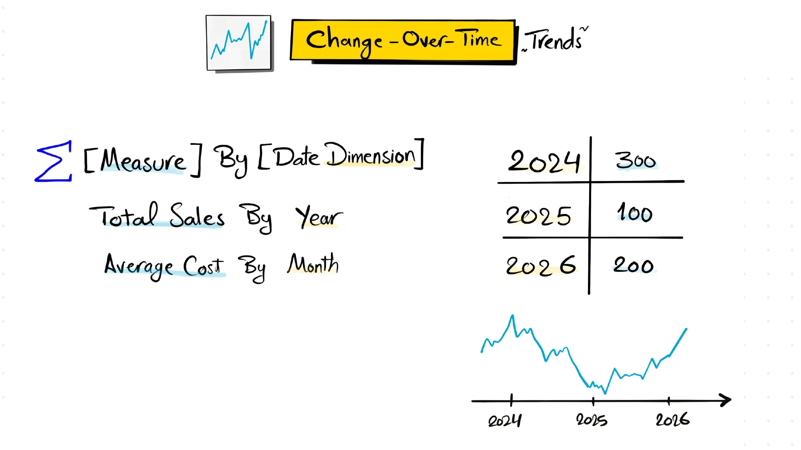

#### 2. Cumulative Analysis

Aggregate values progressively over time. Helps understand **overall growth, accumulation, and whether the business is progressing or declining**.

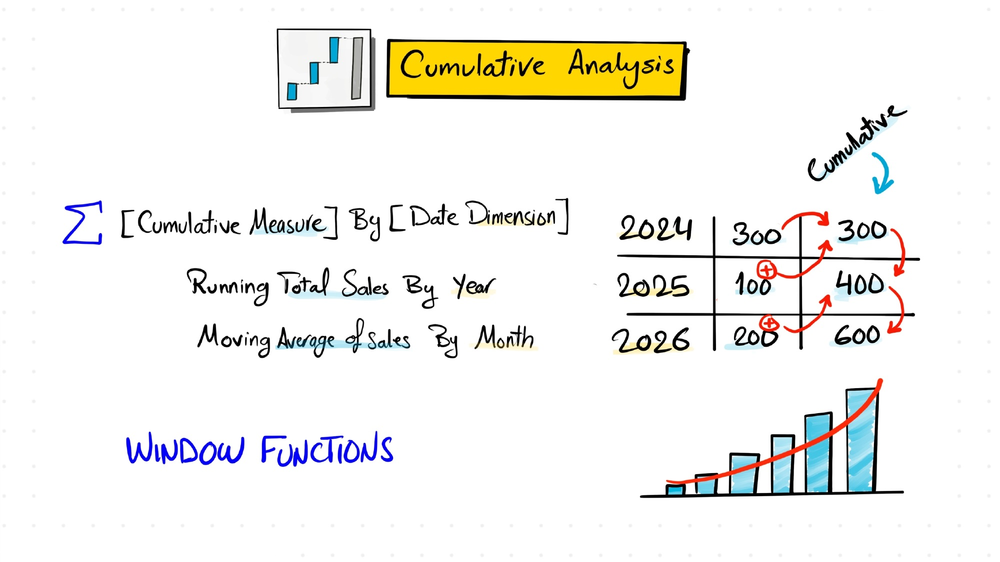

#### 3. Performance Analysis

Compare actual performance against a **target, benchmark, previous period, or expected value**. Helps measure success and identify **performance gaps**.

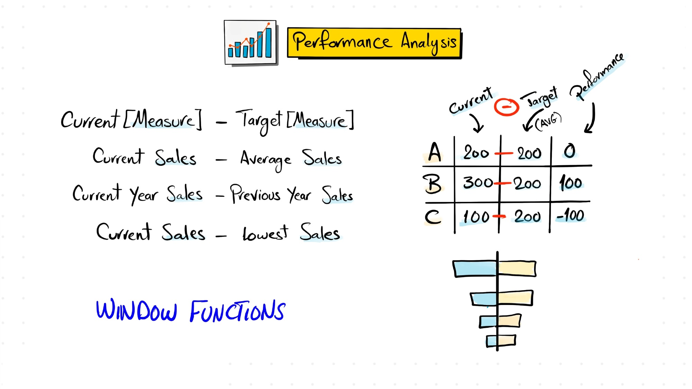

#### 4. Part-to-Whole — Proportional Analysis

Analyze how an individual part contributes to the overall total. Helps identify **which categories have the greatest or smallest contribution to the business**.

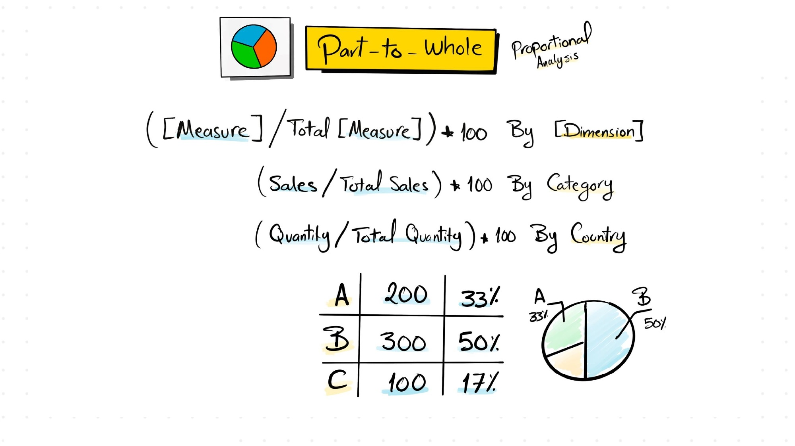

#### 5. Data Segmentation

Group data into meaningful segments based on specific characteristics, ranges, or business rules. Helps identify **patterns and relationships within different segments** and understand how measures behave across them.

> Your original definition — *"Helps understand the correlation between two measures"* — is more specifically describing **correlation analysis**, not data segmentation.
> 

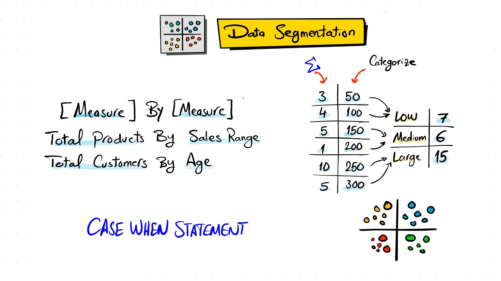

#### 6. Reporting

Present the results of the analysis in a clear and structured format using **KPIs, charts, tables, and summaries**. Helps stakeholders quickly understand **business performance, trends, insights, and areas requiring attention**.

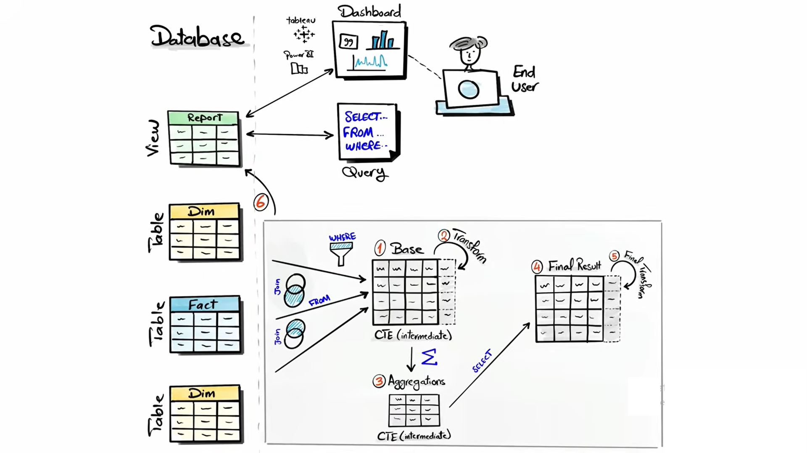

---

## Key SQL Learnings

While working on this project, I strengthened my understanding of SQL and learned how to choose the right approach based on the problem I was solving.

### 1. GROUP BY vs Window Functions

One of the most important concepts I learned was understanding when to use `GROUP BY` and when to use window functions.

- **`GROUP BY`** → Use when I want to **collapse rows** and produce fewer rows.
- **Window functions** → Use when I want to **keep the original rows** while adding calculations.

My decision rule:

```
Do I want fewer rows?
    ↓
GROUP BY

Do I want to keep all original rows?
    ↓
Window Function
```

I also learned common use cases for window functions:

```sql
ROW_NUMBER()
RANK()
DENSE_RANK()
LAG()
LEAD()
SUM() OVER (...)
```

### 2. GROUP BY Rule

I learned an important rule when using `GROUP BY`:

> Every expression in `SELECT` must ultimately produce **one value per group**.
> 

```sql
-- In a SELECT with GROUP BY, every selected column must either
-- be in the GROUP BY or be wrapped in an aggregate function
-- like SUM(), MIN(), MAX(), AVG(), or COUNT().
```

This helped me understand why columns that are neither grouped nor aggregated cause SQL errors.

### 3. CTEs and Dependent CTEs

I learned that multiple dependent CTEs can be created using a **single `WITH` clause**, with each CTE separated by a comma.

```sql
WITH customer_spending AS
(
    SELECT ...
),

segmented_customers AS
(
    SELECT ...
    FROM customer_spending
)

SELECT *
FROM segmented_customers;
```

A later CTE can reference an earlier CTE, which allows complex logic to be broken into clear, logical steps.

### 4. CTE Scope and Reusability

I learned that a CTE is available only for the **single SQL statement** that follows it.

Therefore, the same CTE cannot be directly reused across multiple independent queries.

Depending on the requirement:

```
One query
    ↓
CTE

Multiple queries in the same session
    ↓
Temporary Table

Reusable logic across queries
    ↓
View
```

### 5. Creating Views with CTEs

I learned that a view can contain CTEs as part of its query definition.

```sql
CREATE VIEW gold.customer_segments AS

WITH customer_spending AS
(
    SELECT ...
),

segmented_customers AS
(
    SELECT ...
    FROM customer_spending
)

SELECT *
FROM segmented_customers;
```

The CTE is part of the query used to define the view, while the **view itself becomes reusable across different queries**.

I also learned that the parentheses belong to the CTE definition; the view itself is created using:

```sql
CREATE VIEW view_name AS
SELECT ...
```

### 6. Breaking Complex SQL into Logical Steps

Another key learning from the project was that complex SQL becomes easier to understand when I break the logic into stages.

For example:

```
Raw Sales Data
      ↓
Customer-Level Aggregation
      ↓
Customer Spending CTE
      ↓
Customer Segmentation CTE
      ↓
Final Result
```

Using CTEs helped me separate **calculation logic** from **business logic**, making the query easier to read, debug, and maintain.

### Key Takeaway

The biggest lesson from this project was not just learning individual SQL functions, but learning **how to choose the right SQL technique for the problem**:

```
GROUP BY
→ Collapse rows

Window Function
→ Keep rows + calculate

CTE
→ Break complex logic into steps

Temporary Table
→ Reuse intermediate results within a session

View
→ Create reusable query logic
```

These concepts helped me write SQL that is more structured, readable, and aligned with the analytical question being solved.

---

### 🛡️ License

This project is licensed under the [MIT License](LICENSE). You are free to use, modify, and share this project with proper attribution.
